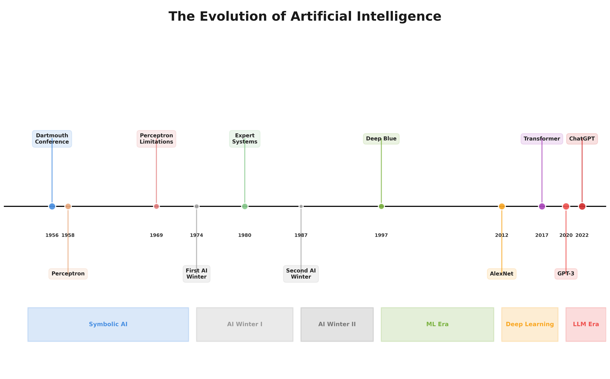
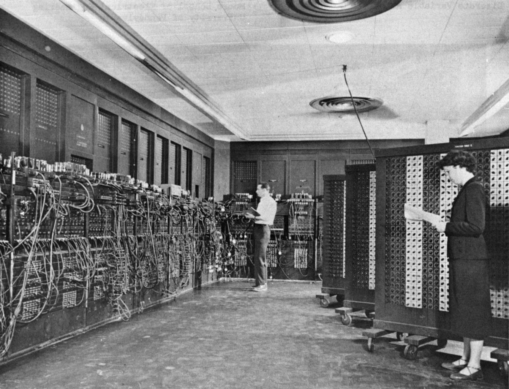
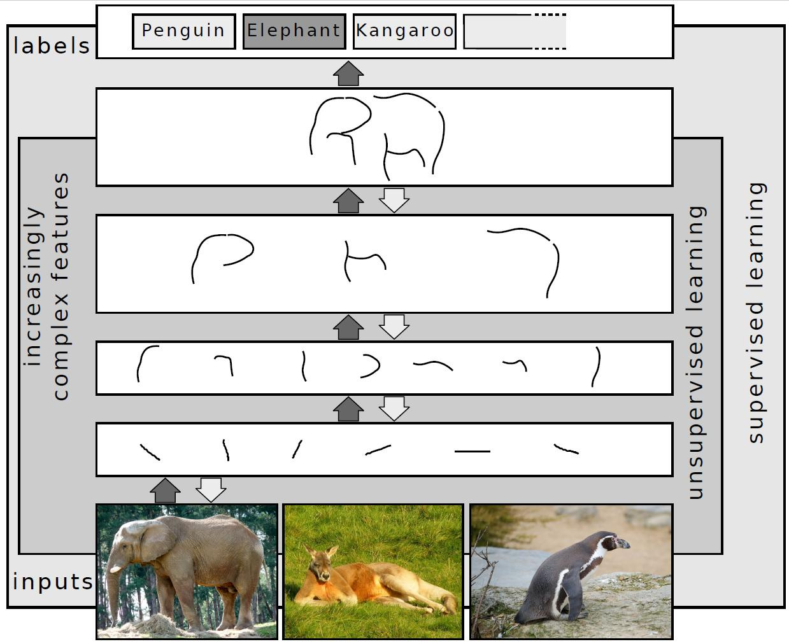
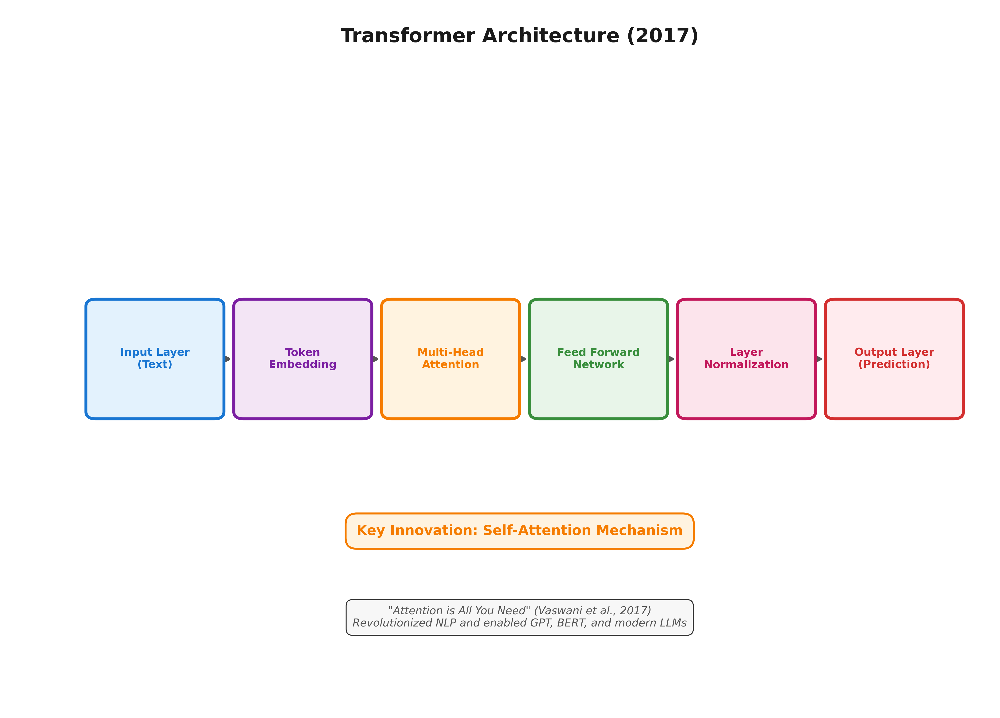
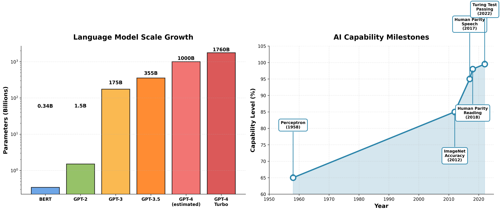

# AI发展简史

## 起源：达特茅斯会议 (1956)

1956年，John McCarthy、Marvin Minsky等人在达特茅斯会议上首次提出"人工智能"概念，标志着AI作为独立学科的诞生。早期研究聚焦符号推理与问题求解，1958年Frank Rosenblatt发明感知机，奠定神经网络基础。

## 深度学习革命 (2012-2019)

2012年AlexNet在ImageNet上将错误率从26%降至15.3%，宣告深度学习时代到来。此后GAN、ResNet、AlphaGo相继突破，AI在图像、博弈等领域超越人类水平。

## 大语言模型时代 (2020-至今)

2017年Transformer架构诞生，2022年ChatGPT引爆全球。模型规模从BERT的3.4亿参数增长到GPT-4的万亿级别，展现出思维链推理、上下文学习等涌现能力。

